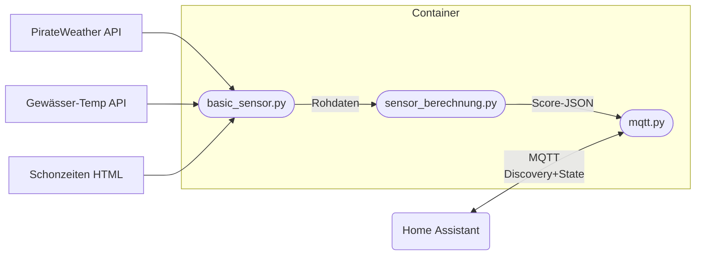

# 🎣 FishingScore Docker – Tradition trifft Technik

> *“Fischen war schon immer Wissenschaft – wir zeigen endlich die Zahlen dazu.”*

Dieses Container‑Projekt berechnet die **Fangwahrscheinlichkeit (%) für jede im `fisch.json` hinterlegte Fischart** und veröffentlicht das Ergebnis **alle 10 Minuten als MQTT‑Sensor** (inklusive Home‑Assistant‑Discovery).
Damit bringst du die Erfahrung alter Anglertraditionen in dein Smart‑Home, ohne dich mit Tabellenbüchern, Mondkalendern und Wetterkarten herumzu­schlagen.

---

## Inhaltsverzeichnis

1. [Architektur](#architektur)
2. [Datenquellen](#datenquellen)
3. [Algorithmus & Gewichtungen](#algorithmus--gewichtungen)
4. [Docker‑Container](#docker-container)
5. [Umgebungsvariablen](#umgebungsvariablen)
6. [MQTT‑Integration](#mqtt-integration)
7. [Persistente Daten & Volumes](#persistente-daten--volumes)
8. [Logging](#logging)
9. [Entwicklung & Tests](#entwicklung--tests)
10. [FAQ](#faq)
11. [Lizenz](#lizenz)

---

## Architektur



| Ebene             | Aufgabe                                                                                                        | Skript                 |
| ----------------- | -------------------------------------------------------------------------------------------------------------- | ---------------------- |
| **1 Erfassung**   | Wetter, Mondphase, Luftdruck, Oberflächentemperatur, Schonzeiten sammeln                                       | `basic_sensor.py`      |
| **2 Berechnung**  | Daten normalisieren, Regeln anwenden, gewichtete Gesamtnote 0–100 % berechnen, optimales Zeitfenster bestimmen | `sensor_berechnung.py` |
| **3 Publikation** | Home‑Assistant‑Discovery veröffentlichen,<br/>Score + Attribute als JSON im Topic `fishing/⟨art⟩` retainen     | `mqtt.py`              |

---

## Datenquellen

| Quelle                                      | Zweck                                                           | Hinweis                           |
| ------------------------------------------- | --------------------------------------------------------------- | --------------------------------- |
| **PirateWeather** (`PIRATEWEATHER_API_KEY`) | Temperatur, Luftdruck, Wind, Bewölkung, Niederschlag, Mondphase | Kostenfrei ≤ 1000 Calls / Tag     |
| **SEA\_TEMP\_URL**                          | Aktuelle Wassertemperatur (HTML‑Scraping)                       | Default: Chiemsee / Stock         |
| **FANGZEITEN\_URL**                         | Schonzeiten & ‑maße (Behördliche PDF/HTML)                      | Parser erwartet Tabellenstruktur  |
| **`pressure_prev.json`**                    | Letzter gemessener Luftdruck zur Trendberechnung                | Wird bei jedem Lauf überschrieben |

---

## Algorithmus & Gewichtungen

Die Fangwahrscheinlichkeit errechnet sich nach dem Motto **„Viele kleine Rädchen ergeben das große Ganze.”**

| Faktor           | Gewicht (max 100) | Herleitung                                     |
| ---------------- | ----------------- | ---------------------------------------------- |
| Saison           | 12                | Frühling, Sommer, Herbst, Winter               |
| Wassertemperatur | 10                | Abgleich mit Idealbereich jeder Art            |
| Wassertiefe      |  7                | Tiefe pro Saison laut `fisch.json`             |
| Temp‑Tiefe‑Match | 13                | Bonus wenn beide Parameter perfekt harmonieren |
| Tageszeitfenster | 14                | Sonnenauf‑/untergang ± Puffer                  |
| Nacht‑Boost      |  8                | Einige Räuber jagen lieber im Dunkeln          |
| Regen_Bonus      |  5                | Leichter Regen kann gut sein                   |
| Regen_Malus      |  8                | Zu starker Regen kann schlecht sein            |
| Bewölkung        |  4                | Diffuses Licht, keine Greifvogelschatten       |
| Mondphase        |  6                | Vollmond bremst, Neumond pusht                 |
| Windrichtung     |  3                | „Wind aus West – Fisch beißt best“             |
| Windstärke       |  4                | Zu viel Gischt schreckt ab                     |
| Wassertrübung    |  4                | Klar vs. trüb aus Bayr. Messstation            |

> Die exakten Zahlen findest du in `weights.json`. Passe sie an deine Gewässererfahrung an – das Programm skaliert automatisch.

---

## Docker‑Container

| Basis | `python:3.11‑slim` |
| ----- | ------------------ |

### Build

```bash
git clone https://example.com/fishingscore.git
cd fishingscore
docker build -t fishing-score:latest .
```

### Run (Beispiel)

```bash
docker run -d --name fishing-score \
  -e MQTT_BROKER=192.168.178.10 \
  -e MQTT_USER=ha \
  -e MQTT_PASS=megaSecret \
  -e LATITUDE= \
  -e LONGITUDE= \
  -e PIRATEWEATHER_API_KEY=yourKey \
  -v fishdata:/app/data \
  --restart unless-stopped \
  fishing-score:latest
```

*Port 5000 wird nur für zukünftige REST‑/Flask‑Endpunkte offengehalten und muss aktuell nicht gemappt werden.*

---

## .env-Datei

> **Wichtig :** Aus Datenschutz- und Sicherheitsgründen liegt **keine** `.env`-Datei im Repository. Lege sie selbst an (z. B. per `cp .env.example .env`) und fülle alle Schlüssel aus.

Benötigte Schlüssel – exakt so benennen und ohne Anführungszeichen:

```env
MQTT_BROKER=192.168.178.10
MQTT_PORT=1883
MQTT_USER=ha
MQTT_PASS=megaSecret
MQTT_DISCOVERY_PREFIX=homeassistant
LOOP_INTERVAL=600
PIRATEWEATHER_API_KEY=deinKey
SEA_TEMP_URL=https://beispiel.de/wassertemp.html
FANGZEITEN_URL=https://behoerde.bayern.de/schonzeiten.html
LATITUDE=
LONGITUDE=
TZ=Europe/Berlin
LOG_LEVEL=INFO
```

*Speicher die Datei im Projektwurzelverzeichnis. Beim Docker-Start einfach anhängen:*

```bash
docker run --env-file .env …
```

---

## Umgebungsvariablen

| Variable                 | Default       | Beschreibung                                                         |
| ------------------------ | ------------- | -------------------------------------------------------------------- |
| `MQTT_BROKER`            | 127.0.0.1     | Hostname / IP deines Brokers                                         |
| `MQTT_PORT`              | 1883          | TCP‑Port                                                             |
| `MQTT_USER`              | –             | Benutzername (optional)                                              |
| `MQTT_PASS`              | –             | Passwort (optional)                                                  |
| `MQTT_DISCOVERY_PREFIX`  | homeassistant | Root‑Topic für HA‑Discovery                                          |
| `LOOP_INTERVAL`          | 600           | Sekunden zwischen zwei Läufen                                        |
| `PIRATEWEATHER_API_KEY`  | –             | API‑Key (PirateWeather)                                              |
| `SEA_TEMP_URL`           | –             | HTML‑Quelle für Wassertemperatur                                     |
| `FANGZEITEN_URL`         | –             | HTML/PDF mit Schonzeiten                                             |
| `LATITUDE` / `LONGITUDE` | –             | Dezimalgrad für Sonnenzeiten                                         |
| `TZ`                     | Europe/Berlin | Zeitzone für Logs & Sonne                                            |
| `LOG_LEVEL`              | INFO          | DEBUG, INFO, WARNING, ERROR                                          |

---

## MQTT‑Integration

* **Discovery**
  Topic: `{MQTT_DISCOVERY_PREFIX}/sensor/fischsensor_{art}/config`
  → erzeugt automatisch einen Sensor „`{Art}-Sensor`“ in Home Assistant.

* **State**
  Topic: `fishing/{art}/state` → JSON `{"status": <Fangwahrscheinlichkeit_%>}`

* **Attribute**
  Topic: `fishing/{art}/attributes` → Komplettes Datensatz‑JSON

Alle Nachrichten sind `retain=True`.
QoS 0 reicht aus – wir senden ohnehin alle 10 Minuten neu.

---

## Persistente Daten & Volumes

| Datei                           | Inhalt                | Warum mounten?                      |
| ------------------------------- | --------------------- | ----------------------------------- |
| `pressure_prev.json`            | letzter Luftdruckwert | Trend funktioniert nur mit Historie |
| `analysis.log`                  | Laufzeit‑Logs         | Bequem außerhalb betrachten         |
| `*.json` (Gewichte, Fischdaten) | Einstellungen         | Änderungen ohne Rebuild             |

Beispiel:

```bash
-v $PWD/data:/app
```

---

## Logging

* Standard‑Level: **INFO**
* Datei: `analysis.log`
* Zeitzone: wird via `TZ` korrekt gesetzt (traditionell wichtig, weil Fische keine UTC verstehen).

Werte für `LOG_LEVEL` kannst du jederzeit hochdrehen.

---

## Entwicklung & Tests

```bash
# Lokale venv
python -m venv .venv
source .venv/bin/activate
pip install -r requirements.txt

# Testrun ohne MQTT
python sensor_berechnung.py | jq .
```

Tests laufen klassisch per `pytest`.

---

## Lizenz

MIT – Benutz’ es, verbessere es, teile deine Fang‑Ergebnisse

